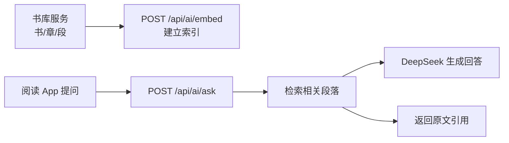

# BookRealm AI Service

**AI 阅读助手:DeepSeek 接入、章节摘要、RAG 原文问答**

这是一个可独立运行的 Spring Boot AI 服务。它从书库服务拉取段落,建立轻量检索索引,再让模型基于原文回答问题,避免“凭空聊天”。

[BookRealm 平台书](https://wohuishuo.github.io/book-realm/) · [本服务实战章](https://wohuishuo.github.io/book-realm/project/ai)

## 一分钟理解

**br-ai-service 让阅读器拥有“问原文”的能力。**

普通聊天模型不知道读者当前看的书。正确做法是先从书库拿到书的段落,按问题检索相关原文,再把这些原文交给 DeepSeek 生成摘要或回答。没有 API key 时,服务仍可启动,并返回检索到的引用依据。



## 已实现功能

| 能力 | 说明 |
| --- | --- |
| 章节摘要 | 对章节文本生成简短摘要 |
| 书籍 embed | 从书库拉取段落并建立检索索引 |
| 原文问答 | 根据问题检索相关段落,再生成回答 |
| 无 key 降级 | 没有 `DEEPSEEK_API_KEY` 也能启动和返回引用依据 |

## 快速开始

```powershell
# 可选:配置 DeepSeek
[Environment]::SetEnvironmentVariable("DEEPSEEK_API_KEY","sk-xxx","User")
[Environment]::SetEnvironmentVariable("SPRING_AI_OPENAI_CHAT_OPTIONS_MODEL","deepseek-v4-flash","User")

# 确保书库服务 :8082 已启动
mvn spring-boot:run
curl http://localhost:8084/api/health
```

Swagger:<http://localhost:8084/api/swagger-ui.html>

## API

| 方法 | 路径 | 说明 |
| --- | --- | --- |
| GET | `/api/health` | 健康检查,显示 key 是否配置 |
| POST | `/api/ai/summary` | 章节摘要 |
| POST | `/api/ai/embed` | 从书库拉段落并建立索引 |
| POST | `/api/ai/ask` | 基于原文问答 |

## 验证示例

```powershell
curl -X POST http://localhost:8084/api/ai/embed `
  -H "Content-Type: application/json" `
  -d "{\"bookId\":1}"

curl -X POST http://localhost:8084/api/ai/ask `
  -H "Content-Type: application/json" `
  -d "{\"bookId\":1,\"question\":\"仙石是什么\"}"
```

实测有 key 时会调用 `deepseek-v4-flash`,并引用《西游记》第一回相关段落回答。

## 在 BookRealm 中的位置

| 上游/下游 | 关系 |
| --- | --- |
| [br-library-service](https://github.com/wohuishuo/br-library-service) | 提供书籍段落和章节文本 |
| [br-reader-app](https://github.com/wohuishuo/br-reader-app) | 调用摘要和问答接口 |
| [book-realm](https://github.com/wohuishuo/book-realm) | 平台总书和完整教学 |

## 文档

| 文档 | 内容 |
| --- | --- |
| [`docs/design.md`](docs/design.md) | RAG 链路、接口、取舍 |
| [`docs/notes.md`](docs/notes.md) | 真实踩坑与验证记录 |
| [平台书实战章](https://wohuishuo.github.io/book-realm/project/ai) | 站在完整平台视角讲解本服务 |

## 测试

```powershell
mvn test
```
